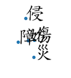
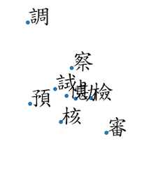
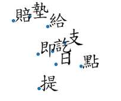
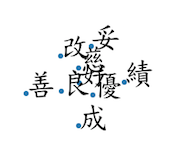
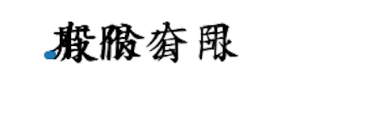
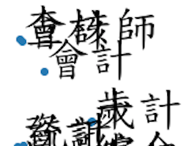
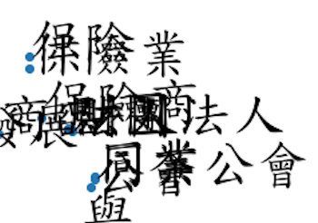
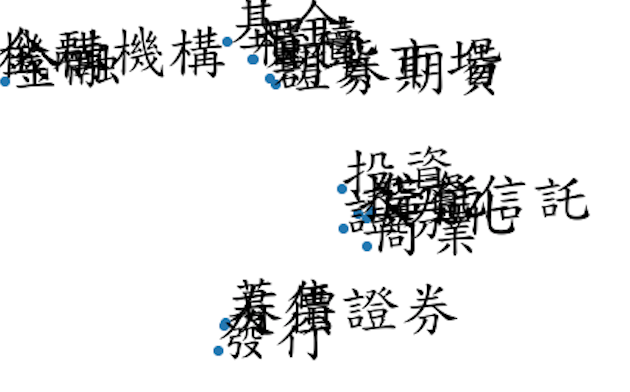
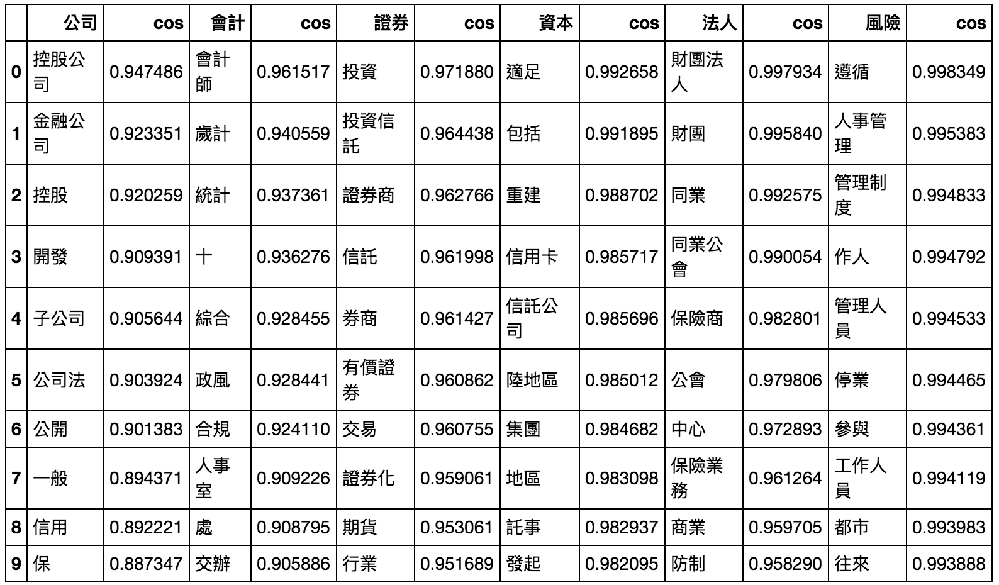

_potential security vulnerability package 'requests'_

# Why I start this project
1. 減少法律遵循人力需求，當公文出現時，推薦匹配法律條文建議，降低人為比對錯誤率。

2. 減少公文格式審核人力

# Technical possibility

## 全國法規資料庫&公文公開
### Laws this project will crawl is included in the catagories below:(You can check and modifiy it in targets.json)
    '行政院本部消費者保護目':'https://law.moj.gov.tw/LawClass/LawClassListN.aspx?TY=04001004',
    '財政部組織目'   :'https://law.moj.gov.tw/LawClass/LawClassListN.aspx?TY=04005001',
    '財政部綜合規劃目':'https://law.moj.gov.tw/LawClass/LawClassListN.aspx?TY=04005002',
    '財政部國際財政目':'https://law.moj.gov.tw/LawClass/LawClassListN.aspx?TY=04005003',
    '財政部推動促參目':'https://law.moj.gov.tw/LawClass/LawClassListN.aspx?TY=04005005',
    '財政部財政資訊目':'https://law.moj.gov.tw/LawClass/LawClassListN.aspx?TY=04005006',
    '財政部國庫目':'https://law.moj.gov.tw/LawClass/LawClassListN.aspx?TY=04005007',
    '財政部賦稅目':'https://law.moj.gov.tw/LawClass/LawClassListN.aspx?TY=04005008',
    '財政部關務目':'https://law.moj.gov.tw/LawClass/LawClassListN.aspx?TY=04005009',
    '財政部國有財產目':'https://law.moj.gov.tw/LawClass/LawClassListN.aspx?TY=04005010',
    '科技部組織目':'https://law.moj.gov.tw/LawClass/LawClassListN.aspx?TY=04015001',    
    '科技部組織目':'https://law.moj.gov.tw/LawClass/LawClassListN.aspx?TY=04015002',
    '科技部園區目':'https://law.moj.gov.tw/LawClass/LawClassListN.aspx?TY=04015003',
    '國家發展委員會組織目':'https://law.moj.gov.tw/LawClass/LawClassListN.aspx?TY=04016001',
    '國家發展委員會 院（處）務目':'https://law.moj.gov.tw/LawClass/LawClassListN.aspx?TY=04016002',
    '國家發展委員會通用目':'https://law.moj.gov.tw/LawClass/LawClassListN.aspx?TY=04016003',
    '國家發展委員會國營經濟事業目':'https://law.moj.gov.tw/LawClass/LawClassListN.aspx?TY=04016004',
    '國家發展委員會人事管理目':'https://law.moj.gov.tw/LawClass/LawClassListN.aspx?TY=04016006',
    '金融監督管理委員會組織目':'https://law.moj.gov.tw/LawClass/LawClassListN.aspx?TY=04018001',
    '金融監督管理委員會消費者保護目':'https://law.moj.gov.tw/LawClass/LawClassListN.aspx?TY=04018010',
    '金融監督管理委員會收費目':'https://law.moj.gov.tw/LawClass/LawClassListN.aspx?TY=04018002',
    '金融監督管理委員會裁罰措施公布目':'https://law.moj.gov.tw/LawClass/LawClassListN.aspx?TY=04018003',
    '金融監督管理委員會金融交易監視目':'https://law.moj.gov.tw/LawClass/LawClassListN.aspx?TY=04018004',
    '金融監督管理委員會基金管理目':'https://law.moj.gov.tw/LawClass/LawClassListN.aspx?TY=04018005',
    '金融監督管理委員會銀行目':'https://law.moj.gov.tw/LawClass/LawClassListN.aspx?TY=04018008',
    '金融監督管理委員會證券暨期貨管理目':'https://law.moj.gov.tw/LawClass/LawClassListN.aspx?TY=04018006',
    '金融監督管理委員會保險目':'https://law.moj.gov.tw/LawClass/LawClassListN.aspx?TY=04018009',
    '金融監督管理委員會檢查目':'https://law.moj.gov.tw/LawClass/LawClassListN.aspx?TY=04018007',
    '金融監督管理委員會金融科技目':'https://law.moj.gov.tw/LawClass/LawClassListN.aspx?TY=04018011',
    '中央銀行總綱目':'https://law.moj.gov.tw/LawClass/LawClassListN.aspx?TY=04026001',
    '中央銀行組織目':'https://law.moj.gov.tw/LawClass/LawClassListN.aspx?TY=04026002',
    '中央銀行業務目':'https://law.moj.gov.tw/LawClass/LawClassListN.aspx?TY=04026003',
    '中央銀行發行目':'https://law.moj.gov.tw/LawClass/LawClassListN.aspx?TY=04026004',
    '中央銀行外匯目':'https://law.moj.gov.tw/LawClass/LawClassListN.aspx?TY=04026005',
    '公平交易委員會組織目':'https://law.moj.gov.tw/LawClass/LawClassListN.aspx?TY=04029001',
    '公平交易委員會公平交易目':'https://law.moj.gov.tw/LawClass/LawClassListN.aspx?TY=04029002'
    
For example,in  this category['行政院本部消費者保護目'](https://law.moj.gov.tw/LawClass/LawClassListN.aspx?TY=04001004')the laws below will be crawled:

    金融服務業從事廣告業務招攬及營業促銷活動辦法
    金融服務業提供金融商品或服務前說明契約重要內容及揭露風險辦法
    金融服務業確保金融商品或服務適合金融消費者辦法
    金融消費爭議處理機構設立及管理辦法
    金融消費爭議處理機構評議委員資格條件聘任解任及評議程序辦法
    金融消費者保護法


公文來自台北公文公開資料
## Official document is easier to do POS, NER


# Dependency
MySQL

For python package, please check out [requirements.txt](./requirements.txt)

(Recently using virtualenv for enviroment management. Migrating to docker.)

# Insallation
1. install mySQL(make sure you have root authority. )

2. clone this project

```
https://github.com/LeeKLTW/legally
```

3. install dependency
```
pip install -r requirement.txt
```

# Test & Demo
1. crawl the law from website
```
python crawler.py
```

```
usage: crawler.py [-h] [--host HOST] [--port PORT] [--user USER]
                  [--password PASSWORD]

optional arguments:
  -h, --help           show this help message and exit
  --host HOST          The host of MySQL
  --port PORT          The port of MySQL
  --user USER          User account of MySQL
  --password PASSWORD  User password of MySQL
```

During crawling, you will see some message as below.( Reminder:Total rows in database might be different.)


The data will store in MySQL as below:


Just as a reminder, the scheme of database is shown below.

| column name     	| type         	| encoding    	| Null     	| Other          	| description          	|
|-----------------	|--------------	|-------------	|----------	|----------------	|----------------------	|
| ID(primary key) 	| int(11)      	|             	| NOT NULL 	| AUTO_INCREMENT 	|  法條索引鍵(唯一)    	|
| LawName         	| varchar(255) 	| utf8mb4_bin 	| Yes      	|                	| 法條名稱             	|
| ActNo           	| int(11)      	|             	| Yes      	|                	| 法條編號,e.g.第 1 條 	|
| ActContent      	| varchar(255) 	| utf8mb4_bin 	| Yes      	|                	| 法條內容             	|

And Table `Law` in [CSV](Law.csv).


2. word embedding

install jupyter notebook

in your command line
```
jupyter notebook
```

execute ```word2vec.ipynb```
In this file we will use word2vec to do word embedding.

And don't forget to set your font property

e.g.
```
font=FontProperties(fname='/Library/Fonts/標楷體.ttf',size=40)
```

And we will use [T-SNE](http://scikit-learn.org/stable/modules/manifold.html#t-distributed-stochastic-neighbor-embedding-t-sne) for dimesion reduction for visualization. PCA is available too!


全圖


Let's have a closer look.

考績


傷害、侵害



investigate



負面金錢往來



正面詞彙（風險降低）



證券金融市場


公司



組織單位


會計審計



保險



證券化



依cos 相似度查詢



$cos( \theta )=\frac{x\cdot y}{||x|| ||y||}$


# Work in progress
  - [x] parse the words
  - [x] embedding
  - [ ] more iteration and higher min counts 
  - [ ] [tensorflow embedding](https://www.tensorflow.org/tutorials/representation/word2vec) (From negative sampling to [NCE](https://papers.nips.cc/paper/5165-learning-word-embeddings-efficiently-with-noise-contrastive-estimation.pdf))
  - [ ] migrate to docker 
  - [ ] crawl Official document
  - [ ] webpage interface
  - [ ] Seq2Seq
  - [ ] classification test
